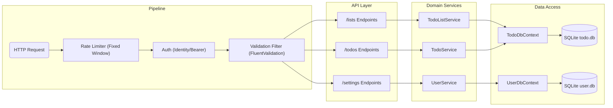
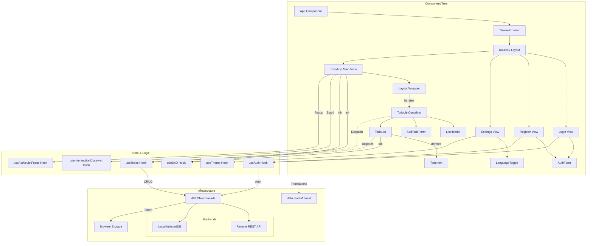

# Todo List Application

A full-stack Todo application built with .NET 10 and React 19.

## Getting Started

### Prerequisites
-   [Devbox](https://www.jetpack.io/devbox) OR .NET 10 SDK + Node.js 22 OR Docker.
-   To install .NET and Node.js on Windows you can use the `scripts/install.bat` script.
-   To install Devbox on Linux, OS X, or WSL, you can use the `scripts/install.sh` script.

### Running Locally

1.  (Devbox only) Enter the shell:
    ```bash
    devbox shell
    ```

2.  Start the backend and frontend:
    ```bash
    npm run start
    ```

### Running with Docker Compose

```bash
docker-compose up --build
```
The application will be available at `http://localhost:5173` (Client) and `http://localhost:5000` (Server).

## Engineering Strategy
I prioritized engineering fundamentals—architecture, scalability, and maintainability—over complex product features. A simple "single route, single form" app often hides how one handles complexity, so I chose patterns that demonstrate enterprise readiness, even if they might seem like overkill for a prototype.

**Core Assumptions:**
*   **Long-Term Lifecycle:** The architecture assumes the tool is intended to last, using patterns that prevent future debt rather than hacking together a disposable prototype.
*   **Universal Design:** i18n, l10n, and Accessibility are treated as core MVP requirements, not post-launch add-ons.
*   **Performance:** Optimized for interaction speed (caching, fast assets) rather than just the absolute minimal first-paint time.

### Functional Scope & Persistence
The core MVP is a Google Keep-style list application with CRUD for Lists/Items, Drag & Drop, and Authentication.

The app supports two persistence modes:
1.  **Authenticated:** Data is synced to the Backend (SQLite).
2.  **Anonymous:** Data is persisted locally using **IndexedDB**.

This increases privacy for users who don't need data syncing and reduces load on the backend.

## Tech Stack

### Frontend (`Sam.TypeScript.Ezra.Todo.Client`)
-   **Core**: React 19, Vite, TypeScript.
-   **Styling**: Tailwind CSS v4.
-   **Icons**: Lucide React.
-   **I18n**: `react-i18next`.
-   **Testing**: Vitest, React Testing Library, Playwright.

### Backend (`Sam.CSharp.Ezra.Todo.Server`)
-   **Core**: .NET 10, ASP.NET Core Minimal API.
-   **Data**: Entity Framework Core, SQLite.
-   **Auth**: ASP.NET Core Identity.
-   **Validation**: FluentValidation.
-   **Docs**: Scalar (OpenAPI).

## Architecture

The solution is structured as a split-stack architecture with separate frontend and backend projects.

### Backend Architecture (ASP.NET Core Minimal API)
The backend follows **Domain-Driven Design (DDD)** principles. I separated the User and Todo domains into distinct `DbContext`s to prevent coupling and allow independent evolution.

*   **Unidirectional Flow:** Higher layers build on lower definitions, preventing circular dependencies by design.
*   **Service Layering:** `Thin Routes` → `Service Layer` → `Repository (DbContext)`.
*   **Contracts:** DTOs are decoupled from Database Entities, so internal schema changes don't break external API clients.



### Frontend Architecture (React + Vite + TS)
The frontend mirrors the backend composition to reduce context switching.

*   **State Management:** State is managed via custom hooks (`useTodos`, `useDnD`) using a unidirectional "props-down, events-up" data flow. I avoided global state libraries like Redux or Context to keep the services decoupled.
*   **UX Patterns:**
    *   **Infinite Scroll / Pagination:** The backend supports pagination to handle scale.
    *   **Master-Detail Navigation:** Efficient keyboard navigation pattern.
    *   **Dark Mode:** Included as a core MVP feature (as it should be).



## Infrastructure & Developer Experience

### Containerization & Setup
To support the main workflows that I care about as a developer:
1.  **Docker Compose (Standard):** Reproducible destructible environments with high production parity.
2.  **Devbox (Hermetic/Nix):** Reproducible local environment compatible with all dev tools.
3.  **Native (Local install):** Minimal dependencies for one-off development.

### CI/CD
GitHub Actions are configured to Build, Test, and Lint on every push to enforce quality gates immediately.

## Trade-offs & Retrospective

Below are the trade-offs made during development and areas identified for future improvement.

### Deferred Scope
*   **IaC (Pulumi):** I originally planned to deploy to Kubernetes using Pulumi.net (C#), but time was better spent on application logic since infrastructure scripts are rarely executed in an interview context.
*   **Migrations:** SQLite seems to have some EFCore migration limitations that wouldn't apply in production to Postgres or SQL Server, so I deferred them.
*   **Playwright (E2E):** Present for verification and to ensure UI stability, but the automation isn't seamless yet.
*   **Backend Resource Limits:** Future expansions would include stricter server-side protections, such as limiting the maximum number of lists per user and the number of items per list, to prevent resource exhaustion.
*   **More Tests:** I prioritized a level of test coverage that gave me good confidence during development, but to productionize this app I'd want to take a significant pass on improving coverage.

### Critique
*   **Drag & Drop:** While functional, the implementation is a bit tangled. I leaned on LLM assistance for the state logic, and the result isn't as elegant as the manually architected sections. It needs a refactor.
*   **Client-Side Persistence:** Using **IndexedDB** was robust but arguably overkill for a prototype. A simple `localStorage` wrapper would have been fine.
*   **Naming Collision:** I named the local DB wrapper `localStorage`, which is confusing alongside the browser's `localStorage` API. I'd rename this to `LocalDb` or `DeviceStorage` in a future pass.
*   **Magic Variables:** Rate limits and character counts are hardcoded. Ideally we'd extract these to `appsettings.json`.

### LLM Usage
*   **Used for:** Syntax modernization (C#), Tailwind class lookups and assignment, scaffolding, and Drag & Drop state logic, generating tests and docs, and tracking my engineering notes.
*   **Not used for:** Core architectural decisions, domain modeling, or trade-off analysis.
